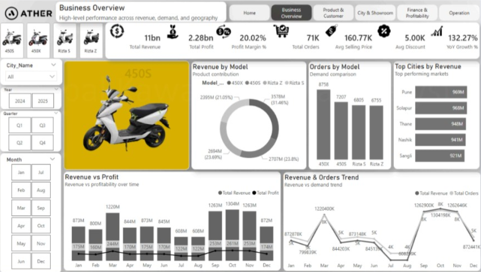
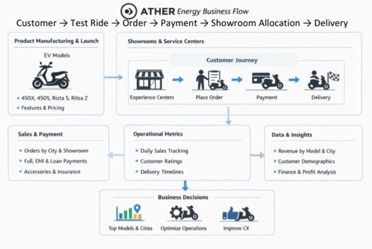
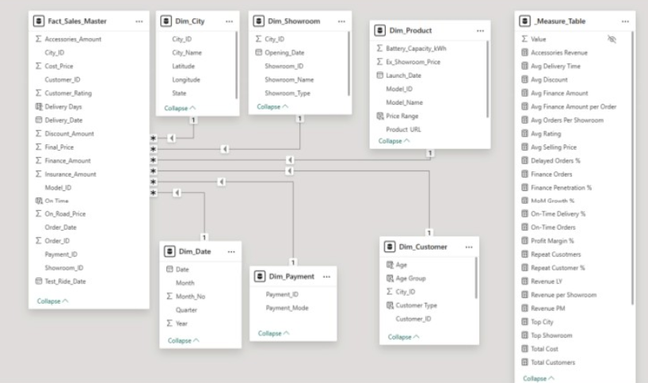

# Electric Vehicle (EV) Sales & Operations Analytics

  

## Overview
Electric vehicle manufacturers face complex scaling bottlenecks—from managing regional order fulfillments and dealership yields to tracking high-value inventory and loan financing approvals.

**Ather EV Analytics** is an end-to-end data analytics project designed to track EV retail operations and business performance. Built around Power BI, SQL Server, and Python, this solution translates raw sales, store, and logistics telemetry into clear operational metrics—helping business leaders optimize revenue, streamline delivery SLAs, and maximize unit profitability.

---

## Executive Presentation
A detailed 10-slide executive summary breakdown covering business context, data architecture, regional performance, and logistics analytics is available in the documentation folder:

📁 **[View Presentation Deck (PDF)](./Docs/Electric-Vehicle-Sales-and-Operations-Dashboard.pdf)**

---

## Technical Architecture
The data pipeline flows from transactional telemetry generation through database staging, Power Query ETL, star schema modeling, and interactive reporting.

  

* **Data Ingestion (Python):** Scripted synthetic telemetry and transactional sales records, ensuring structural data integrity.
* **Database Management (SQL Server):** Centralized relational database tables for transactional tracking and query execution.
* **ETL & Data Cleaning (Power Query):** Cleaned raw tables, transformed data types, handled nulls, and executed automated transformation logic.
* **Data Modeling (Power BI):** Modeled a Star Schema linking 1 central Fact Table (`Fact_Sales_Master`) to 6 Dimension Tables (`Customer`, `Product`, `City`, `Showroom`, `Payment`, `Date`).
* **BI & Data Visualization (Power BI):** Developed interactive dashboards utilizing DAX measures for real-time financial, demographic, and operational reporting.

---

## Data Model (Star Schema)

  

An optimized Star Schema was built inside Power BI to handle multi-dimensional reporting efficiently:
* **Central Fact Table:** `Fact_Sales_Master` containing order details, revenue metrics, quantities, and operational timestamps.
* **Dimension Tables:** Integrated 6 normalized lookup tables (`Dim_Customer`, `Dim_Product`, `Dim_City`, `Dim_Showroom`, `Dim_Payment`, `Dim_Date`) with 1-to-many relationships to support seamless slicing and dicing.

---

## Business Impact & Findings
1. **Model Dominance & Accessories:** The flagship Ather 450X leads sales with a 31.46% revenue share, while accessory add-ons generated an additional ₹141 Million in margin revenue.
2. **Financing Dependency:** Nearly half of all vehicle purchases (47.89%) rely on third-party loans or credit card EMIs, making flexible financing partnerships critical for sustained sales growth.
3. **Logistics Bottlenecks:** Around 37.21% of orders experience delivery delays beyond standard SLAs. Streamlining these handoffs is the single most effective operational lever to boost overall customer CSAT from 3.88 to 4.5+.

---

## Author
**Pushpal Kawara**  
*Data Analyst & Power BI Specialist*

* Email: pushpalanalytics@gmail.com
* LinkedIn: https://www.linkedin.com/in/pushpalanalytics/
